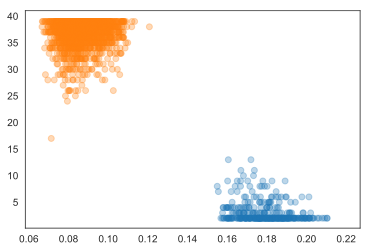
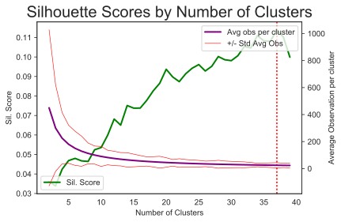
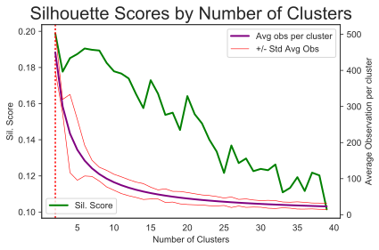
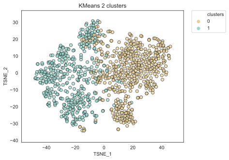
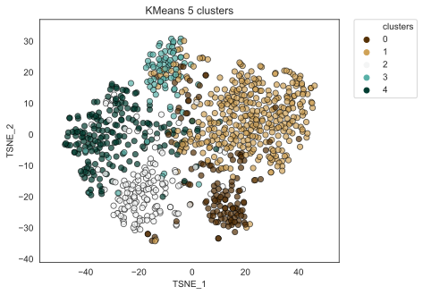

---
# Classifying NPR
Jordan Landers | Thinkful | Unit 4 Capstone

---

## Motivation
- How distinctive are correspondents? 
- Are NPR reports linked to authors by topic or by style?

# Getting Data

---

## Scrapy & Selenium
- Scrapy spider with Selenium browser simulator to extract links from a user initiated infinite scroll page.
- Scrapy spider to extract transcript text and metadata.

:::notes
- For each correspondent, the initial page loads with approximately 10 links and then waits for a user to scroll down the page before loading more.  I used selenium to simulate the user (it literally opens a browser window) scroll ten times before scraping transcript links.  
- Not all pieces have transcripts.
:::

# Prepping Data

---

## Cleaning and Splitting
- Split transcripts along dialogue lines
- Matched speaker to comment
- Identified host and byline
- Scrubbed reporter names from comment transcript

:::notes 
- Made sure to remove reporter names from comment transcripts to make sure models couldn't train based on labels being in content
- In a few cases, correspondents also host shows, so dialogue was tagged as host according to who was identified as host in the transcript so that the two scenenarios distinguished
:::

## Final Data
- For each story, host and interviewee comments were filtered out, leaving correspondent comments.
- Stop words, punctuation, numbers were removed from comments and lower case words were lemmatized using Spacy.
- Words were joined back into strings.
- Downsampled the available data to reduce class imbalance (class by speaker).

:::notes
- So final key-value pairs look like speaker-string, where the string is a joined list of supposedly important words.  This is the format that can be processed into a TaggedDocument.
- Original concentrated text (all text from the correspondent for a given piece) was preserved for TF-IDF processing
:::

# Workflow

---

## Overview
- Unsupervised Feature Creation
- Clustering
- Supervised Classification by author

:::notes
- The unsupervised feature creation was parameter tuned by exhaustively creating parameter sets, generating features, clustering them, recording number of clusters and sillohouette scores, and looking at best scoring parameter sets and cluster numbers.
- Unsupervised features were then used to train supervised classifiers.
::: 

# Unsupervized Feature Creation

---

## Doc2Vec
- Comment text was broken into words, tagged by document, and used to build corpus vocabulary.
- Tagged documents were used to train Doc2Vec representation with prescribed parameters.

* Parameters were chosen through exhaustive parameter search.

:::notes
- doc2vec is an extention of word2vec
:::

## TF-IDF & LSA
- raw text blocks were fed into sklearn tf-idf vectorizer
	- processed without stop words as 1-grams and 2-grams
- lsa implemented with pipeline connecting tf-idf and svd

:::notes
- TF-IDF stands for term frequency-inverse document frequency; calculate a score for each ngram based on the frequency with which it comes up in a certain document relative to how many documents it appears in in the corpus
- LSA stands for Latent Semantic Analysis and involves using Singular Value Decomposition to reduce the number of dimensions of the bag of ngrams
:::

# Clustering

---

## KMeans: Choosing reporters
- Modelled and scored with `range(2,50)` clusters with the first x combinations of the 20 choose 10 combinations of reporters with more than 120 reporting pieces available. Modelled with both LSA and doc2vec feature sets. 

## KMeans: Choosing reporters (cont.)
| **LSA** | **Doc2Vec** | 
|:-:|:-:|
|score = .11, clusters = 37 | score = .21, clusters = 2|

:::notes
- LSA scores ranged from approximately .04 to .12
- Doc2Vec scores ranged from x to y with a tendancy toward a two cluster split, but some variability depending on the author set chosen. 
- Exhaustive search limited by computing resources.  Potentially worth trying on a cluster to find the combination of reporters most representative.  
:::

## KMeans: Considering Clusters
Doc2Vec features performed better than LSA features, consistently splitting the document set into two clusters: Science/Not Science.

| **LSA** | **Doc2Vec** | 
|:-:|:-:|
||| 
|score = .11, clusters = 37 | score = .21, clusters = 2| 

:::notes
- within top 4 scoring clusterings for d2v, all had only two clusters
- within top 4 scoring clusterings for lsa, all clustered in mid 30s 
:::

## Visualizing Clusters with TSNE
- Trained T-SNE model on tagged documents to obtain a set of axes potentially useful for visualizing clusters (also tried PCA, though TSNE was more effective)

:::notes
- T-SNE stands for t-distributed Stochastic Neighbor Embedding
- dimensionality reduction technique for visualizing high dimensional data at two or three dimensions
- tsne plots often display clusters whether or not the data set has a clustered structure
:::

## Clustering Clusters
- Clustering the participants of each cluster but only keeping the sub-clustering if the silhouette score surpassed the average of the initial clustering
- `num_clusters` = 2 split into: (Politics, Health Care), (Health Science, Tech, Natural Science & Aerospace)

| **2 Clusters** | **5 CLusters** | 
|:-:|:-:|
||| 

## Clustering Observations
- Predicting subject of NPR reporting pieces is sensitive to reporters chosen, as well as the news pieces themselves.  
- Improvements might include:
	- Varying downsampling to find optimal training set size
	- Doing a more complete search for an optimal combinations of reporters to identify the set that best characterize news subjects
	- Clustering a large number of times with a given reporter set to identify consistent clusters

# Supervised Classifiers

---

## Doc2Vec

| **Model** | **Train Score** | **Test Score** |
|:-:|:-:|:-:|
| Logistic Reg | .72 | .08 |
| Grad Boosting |  1| .07 |
| SVC | 1 | .07 |

## LSA

| **Model** | **Train Score** | **Test Score** |
|:-:|:-:|:-:|
| Logistic Reg | .93 | .83 |
| Grad Boosting | 1 | .73 |
| SVC | .11 | .07 |

## Supervised Classifier Observations
- LSA features train a much more accurate author classifier than Doc2Vec.
- Doc2Vec captures content but NPR reporters cover a range of topics in a loose field, so are not distinctive by subject.
- Within the scope of this training set, topic vectors in training set for one author are not predictive of topic vectors of that author in the test set.

# Conclusions

---

## Data
- These models could potentially be improved by tuning the data set.
	- Picking Reporters (and number)
	- Framing article date window
	- Optimizing per author sample size 
* Exhaustively sampling and testing would require additional computational resources.

## Modeling
- Other clustering methods, iterative clustering, cluster tuning might all improve clustering results
- Supervised author classifiers could be tuned, but perform well.

# Thank you!
-  https://github.com/jordanplanders/ 

